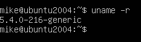
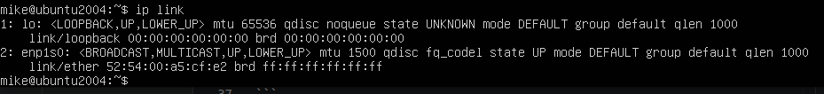
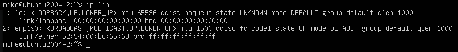
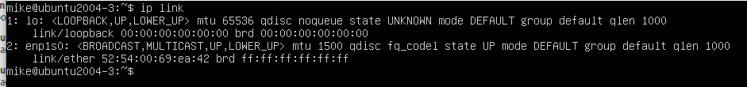
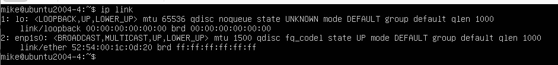
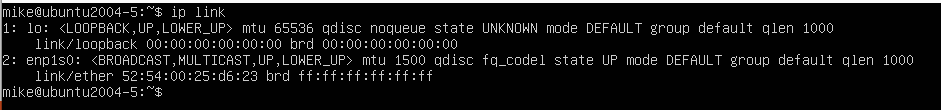
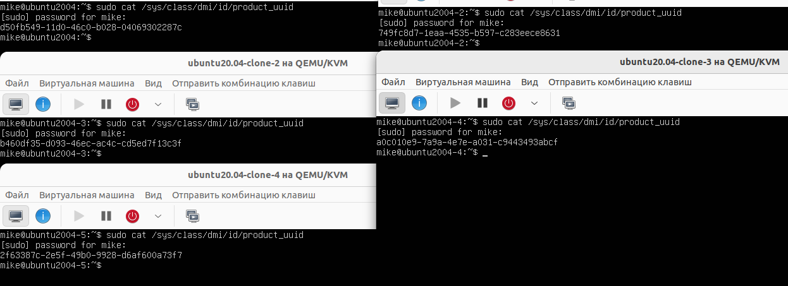
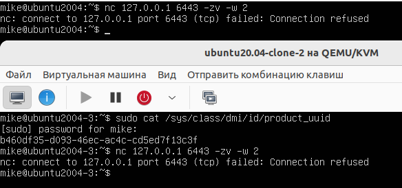
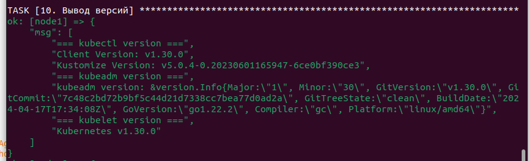

# Домашнее задание к занятию "`Установка Kubernetes`" - `Белов Михаил`

### Цель задания

Установить кластер K8s.

------

### Чеклист готовности к домашнему заданию

1. Развёрнутые ВМ с ОС Ubuntu 20.04-lts.

### Инструменты и дополнительные материалы, которые пригодятся для выполнения задания

1. [Инструкция по установке kubeadm](https://kubernetes.io/docs/setup/production-environment/tools/kubeadm/create-cluster-kubeadm/).
2. [Документация kubespray](https://kubespray.io/).

-----

### Задание 1. Установить кластер k8s с 1 master node

1. Подготовка работы кластера из 5 нод: 1 мастер и 4 рабочие ноды.
2. В качестве CRI — containerd.
3. Запуск etcd производить на мастере.
4. Способ установки выбрать самостоятельно.

#### 1. Подготовка

а. Проверить версию ядра командой:
```
uname -r
```


- Переименовать все склонированные машины:
```
hostnamectl set-hostname <новое_имя>
```

б. Проверить MAC адрес командой:
```
ip link или ifconfig -a
```






в. Проверить product_uuid командой:
```
sudo cat /sys/class/dmi/id/product_uuid
```


г. Проверьте открытые порты, допустим, для 6443 порта команда:
```
nc 127.0.0.1 6443 -zv -w 2
```


д. Отключите swap (Kubelet не работает при активном swap-пространстве) командой:
```
sudo swapoff -a
sudo sed -i '/ swap / s/^/#/' /etc/fstab
```
е. Установите среду для работы контейнеров (одну из вариантов). Стандартный Docker не поддерживается в k8s — требуется специальная версия cri-dockerd.
- containerd. [Официальная документация](https://github.com/containerd/containerd/blob/main/docs/getting-started.md)
```
sudo su
apt update && apt install -y containerd
```
- CRI-O. [Инструкция по установке](https://github.com/cri-o/packaging/blob/main/README.md#usage)
- cri-dockerd. [Официальный сайт ](https://mirantis.github.io/cri-dockerd/)

ж. Задать в netplan каждой из машин свой IP-адрес:
```
# Файл /etc/netplan/00-installer-config.yaml:
network:
  ethernets:
    enp1s0:
      dhcp4: false
      addresses:
        - 192.168.122.<свой_октет>/24
      routes:
        - to: default
          via: 192.168.122.1
      nameservers:
        addresses: [8.8.8.8, 1.1.1.1]
  version: 2
```
- Применить:
```
sudo netplan apply
```

#### 2. Установка зависимостей (выполняем на всех нодах):

а. Подготовка apt:
```
sudo apt-get update
sudo apt-get install -y apt-transport-https ca-certificates curl gpg
```
б. Подключение репозитория kubernetes:
```
sudo mkdir -p -m 755 /etc/apt/keyrings
curl -fsSL https://pkgs.k8s.io/core:/stable:/v1.33/deb/Release.key | sudo gpg --dearmor -o /etc/apt/keyrings/kubernetes-apt-keyring.gpg
echo 'deb [signed-by=/etc/apt/keyrings/kubernetes-apt-keyring.gpg] https://pkgs.k8s.io/core:/stable:/v1.33/deb/ /' | sudo tee /etc/apt/sources.list.d/kubernetes.list
```
в. Обновление индекса apt:
```
sudo apt-get update
```
#### 3. Установка основных компонент:
```
apt update && apt install -y kubelet kubeadm kubectl
```
#### 4. Включите сервис kubelet:
```
sudo systemctl enable --now kubelet 
```
- Для выполнения пунктов 2 - 4 можно создать [playbook](kubernetes-install.yaml) Ansible и [файл инвентаря](inventory.ini)
- Запуск playbook:
```
ansible-playbook -i inventory.ini kubernetes-install.yaml -u mike -K
```


#### 5. Если используются cgroups (Linux control groups), настройте драйвер cgroups для kubelet. [Настройка драйвера cgroups в kubeadm](https://kubernetes.io/docs/tasks/administer-cluster/kubeadm/configure-cgroup-driver/)

- Настройка с помощью Ansible на всех нодах:
```
ansible-playbook -i inventory.ini containerd-cgroup.yaml -u mike -K
```
- Запуск кластера:
```
ansible-playbook -i inventory.ini master-node.yaml -u mike -K
```

## Дополнительные задания (со звёздочкой)

**Настоятельно рекомендуем выполнять все задания под звёздочкой.** Их выполнение поможет глубже разобраться в материале.   
Задания под звёздочкой необязательные к выполнению и не повлияют на получение зачёта по этому домашнему заданию. 

------
### Задание 2*. Установить HA кластер

1. Установить кластер в режиме HA.
2. Использовать нечётное количество Master-node.
3. Для cluster ip использовать keepalived или другой способ.

### Правила приёма работы

1. Домашняя работа оформляется в своем Git-репозитории в файле README.md. Выполненное домашнее задание пришлите ссылкой на .md-файл в вашем репозитории.
2. Файл README.md должен содержать скриншоты вывода необходимых команд `kubectl get nodes`, а также скриншоты результатов.
3. Репозиторий должен содержать тексты манифестов или ссылки на них в файле README.md.